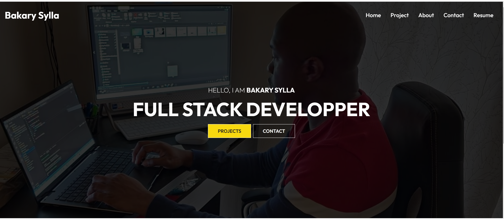
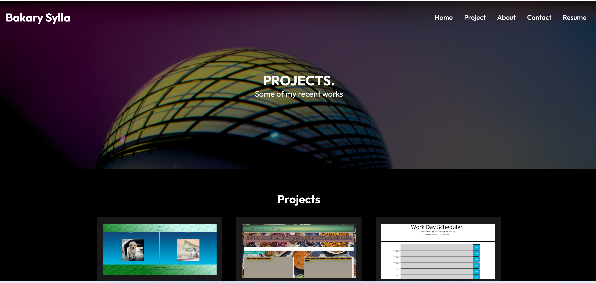
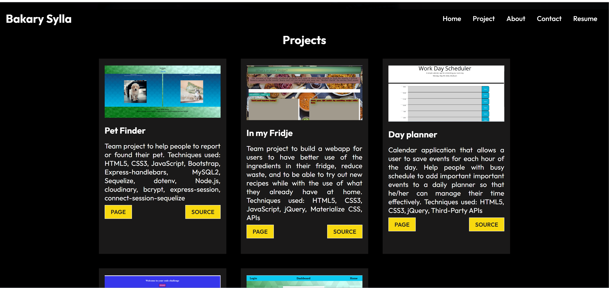
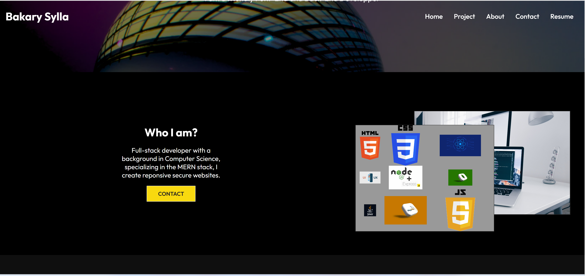
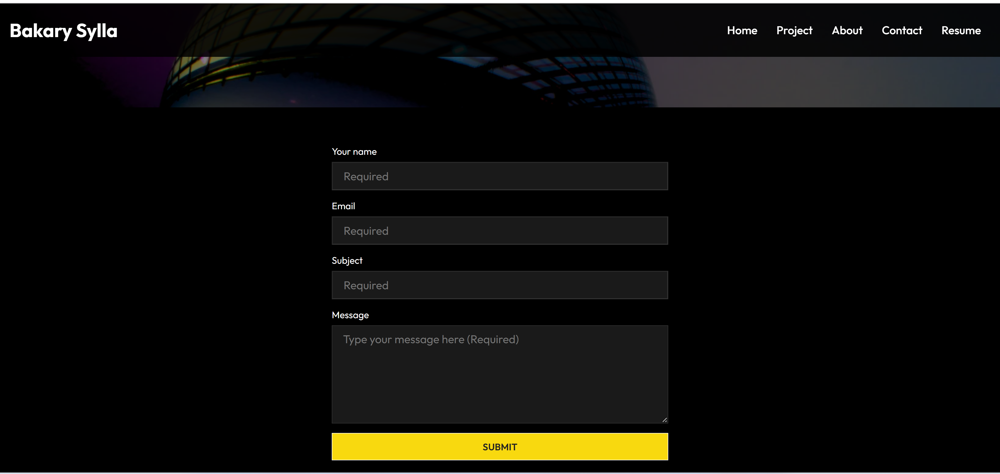

# My React Portfolio

https://myportfolioreactsecond.herokuapp.com/

    ## Table of Contents:

    1. Descriptions
    2. Mock-Up
    3. Github
    4.Question

## Description

```
GIVEN a single-page application portfolio for a web developer
Crafted with precision, the single-page portfolio of a seasoned web developer offers seamless navigation and captivating content. Upon loading, a well-structured layout emerges, featuring a header, content section, and footer. The header introduces the developer's name and a user-friendly navigation bar, guiding visitors through distinct sections such as About Me, Portfolio, Contact, and Resume.

The navigation dynamically highlights the active section, providing a seamless exploration experience. A simple click swiftly transitions between sections, demonstrating instant content loading without disrupting the flow.

Upon first load, the About Me section takes center stage, featuring a recent photo or avatar alongside a concise bio. The Portfolio section showcases titled images of six applications, each linking to deployed versions and GitHub repositories, showcasing the developer's proficiency.

In the Contact section, a thoughtfully designed form prompts visitors to leave their mark. Fields for name, email, and message offer user-friendly interaction, with real-time notifications for unfilled or incorrectly formatted fields.

The Resume section provides a downloadable resume link accompanied by a list of proficiencies, showcasing the developer's skills. The footer offers convenient links to the developer's profiles on platforms like GitHub, LinkedIn, and a third platform of choice.

This portfolio harmonizes design, interactivity, and user-centricity, inviting visitors to engage with a modern and insightful digital narrative.
```

## Mock-Up

The following animation shows the web application's appearance and functionality:


## App Screenshots











## Github

For any questions feel free to git pull request

[Github](https://github.com/Abou2022/my-portfolio)

## Email

You can email me, if you have any questions

[Email](mailto:syllabakary2002@gmail.com)

---

© 2022 Bakary sylla, Inc. brand. Confidential and Proprietary. All Rights Reserved.
